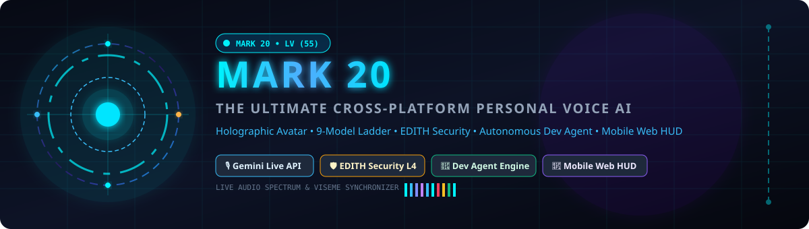
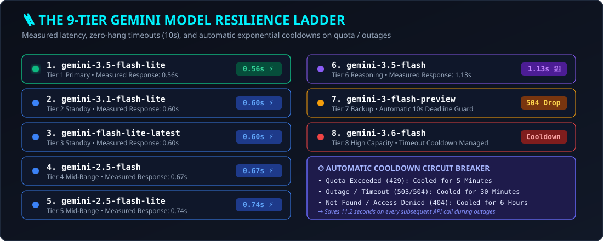
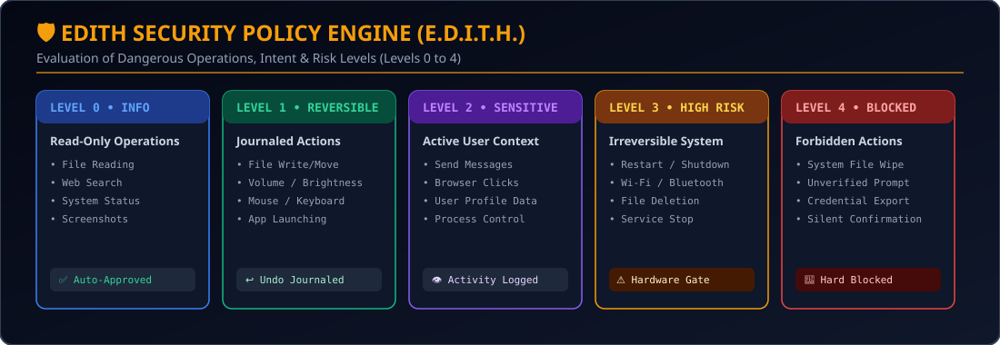

<p align="center">
  <a href="https://github.com/Pranay/Mark-20">
    
  </a>
</p>

<p align="center">
  <a href="https://github.com/Pranay/Mark-20/stargazers"></a>
  <a href="https://github.com/Pranay/Mark-20/network/members"></a>
  <a href="https://python.org"></a>
  <a href="https://ai.google.dev"></a>
  <a href="#-edith-security-protocol"></a>
  <a href="LICENSE"></a>
</p>

---

# ⚙️ MARK 20 — F.R.I.D.A.Y
### The Ultimate Cross-Platform Personal Voice AI Assistant — By Pranay

**MARK 20 (F.R.I.D.A.Y)** is the pinnacle of cross-platform personal artificial intelligence. Designed to replicate the seamless autonomy, intelligence, and presence of Marvel's **F.R.I.D.A.Y.**, MARK 20 gives your AI assistant **a face, a screen, deep OS control, and total digital autonomy**.

Operating natively on **Windows, macOS, and Linux**, MARK 20 streams ultra-low latency audio via the **Gemini Live API**, renders a **software-drawn 3D Holographic Avatar** without needing a GPU, defends system integrity via the **EDITH Security Engine**, and builds software independently using an **Autonomous Developer Agent**.

> *"Say 'play the new Dune trailer' and the video appears where the avatar was — muted until you ask for sound. Tell it to 'build a React weather app on my desktop', and it writes, tests, auto-debugs, and launches the application autonomously."*

---

## 🚀 Key Capabilities Matrix

<table width="100%">
  <thead>
    <tr>
      <th width="28%">Capability</th>
      <th width="72%">Description & Technical Implementation</th>
    </tr>
  </thead>
  <tbody>
    <tr>
      <td><b>🧑‍🎤 3D Holographic Avatar</b></td>
      <td>Software-rendered 468-vertex MediaPipe head geometry in PyQt6 canvas (`core/avatar.py`). Real viseme lip-sync at ~50 shape transitions/sec, natural blinking, eye gaze saccades, and brow movement. No GPU required.</td>
    </tr>
    <tr>
      <td><b>🛡️ EDITH Security Protocol</b></td>
      <td>5-tier real-time risk evaluation engine (`core/edith.py`). Classifies tool calls from Level 0 (Info) to Level 4 (Blocked), enforcing hardware confirmation banners for irreversible system actions.</td>
    </tr>
    <tr>
      <td><b>🤖 Autonomous Dev Agent</b></td>
      <td>Voice-driven full-stack software engineer (`actions/dev_agent.py`). Plans multi-file projects, writes clean code, runs build & unit tests, and self-heals up to 5 iterations on failure.</td>
    </tr>
    <tr>
      <td><b>📋 Mission Planner</b></td>
      <td>Goal decomposition engine (`actions/planner.py`) that converts high-level prompts into ordered atomic steps with step verification, risk auditing, and execution tracking.</td>
    </tr>
    <tr>
      <td><b>🪜 9-Tier Model Ladder</b></td>
      <td>Resilient fallback stack (`core/gemini.py`) across 9 Gemini models. Enforces 10s deadlines and exponential circuit-breaker cooldowns (5m quota, 30m outage, 6h access failure), saving 11.2s per call.</td>
    </tr>
    <tr>
      <td><b>📱 Encrypted Web HUD</b></td>
      <td>FastAPI web dashboard & mobile HUD (`dashboard/server.py`) on Port 8000. Features AES-256-CBC WebSocket security, live terminal output streaming, 500MB remote file upload, and QR code pairing.</td>
    </tr>
    <tr>
      <td><b>💻 Hardware & Laptop Admin</b></td>
      <td>Deep system management (`actions/laptop_control.py` & `computer_settings.py`). Battery telemetry, Wi-Fi/Bluetooth adapter control, process management, window geometry snapping, and service control.</td>
    </tr>
    <tr>
      <td><b>📺 HUD Video Player</b></td>
      <td>HUD surface sharing (`actions/video_player.py` & `youtube_video.py`). Plays YouTube, local files, or video URLs directly on the avatar canvas with dual stream sync (<300ms drift) and original language track sorting.</td>
    </tr>
    <tr>
      <td><b>🎮 Universal Game Manager</b></td>
      <td>Multi-launcher game engine (`actions/game_updater.py`). Auto-detects, checks updates, monitors downloads, and launches games across Steam, Epic Games, GOG, Battle.net, and EA App.</td>
    </tr>
    <tr>
      <td><b>✈️ AI Flight & Travel Finder</b></td>
      <td>Travel research assistant (`actions/flight_finder.py`). Multi-lingual date expression parsing, route price comparison, and natural language travel recommendations.</td>
    </tr>
    <tr>
      <td><b>🧠 Recallable Memory</b></td>
      <td>Unlimited long-term store (`memory/memory_manager.py`). Prompts carry indexed key summaries while `recall_memory` executes instant zero-latency local lookups.</td>
    </tr>
    <tr>
      <td><b>↩️ Reversible Action Undo</b></td>
      <td>Unified undo journal (`core/undo.py`). Instantly reverses file creations, moves, renames, writes, desktop organization, and OS settings changes in any language.</td>
    </tr>
    <tr>
      <td><b>🎧 Audio Device Engine</b></td>
      <td>Measured audio router (`core/audio_devices.py`). Deduplicates device entries (41 → 8), probes host APIs with real silence tests, and selects distinct optimal drivers for mic and speakers.</td>
    </tr>
    <tr>
      <td><b>🌐 Browser Automation</b></td>
      <td>Playwright-powered browser control (`actions/browser_control.py`). Multi-tab navigation, element interaction, text extraction, form submission, and web scraping.</td>
    </tr>
  </tbody>
</table>

---

## 🆕 What's New in MARK 20 & Recent Enhancements

<p align="center">
  
</p>

### 1. 🛡️ EDITH Security Protocol (`core/edith.py`)
MARK 20 introduces the **EDITH (Evaluation of Dangerous Operations, Intent & Risk Levels)** engine. Every tool call requested by the LLM is intercepted and evaluated against five strict security levels:
* **Level 0 (Information)**: Read-only calls (file search, system status, web search, screenshots). Auto-approved.
* **Level 1 (Reversible)**: File creations, moves, volume/brightness adjustments, mouse/keyboard inputs. Auto-approved and registered into the **Undo Journal**.
* **Level 2 (Sensitive)**: Sending messaging communications, active browser clicks, accessing user profiles. Logged to UI audit log.
* **Level 3 (High Risk / Irreversible)**: Shutdown, restart, Wi-Fi toggling, process termination, service stops. Enforces **Hardware UI Confirmation Banners** (the LLM cannot self-confirm).
* **Level 4 (Blocked)**: System root deletions, unauthorized credential exports, unverified prompts. Hard blocked.

### 2. 🤖 Autonomous Dev Agent & Mission Planner (`actions/dev_agent.py` & `actions/planner.py`)
<p align="center">
  
</p>
FRIDAY is now an **autonomous software engineer**. When given a high-level command like *"Build a full-stack weather app on my desktop"*:
1. **Planner (`planner.py`)**: Breaks down the prompt into ordered atomic steps and verifies risk levels.
2. **Dev Agent (`dev_agent.py`)**: Creates project scaffolding in `~/Desktop/FridayProjects/`, generates HTML/CSS/JS/Python files, installs `npm` or `pip` dependencies.
3. **Automated Testing & Self-Healing**: Runs test suites or syntax checks. If compilation fails, Dev Agent extracts the error traceback, feeds it into Gemini, patches the source code, and retries (up to 5 self-healing iterations) until the build passes.

### 3. 📱 Encrypted Mobile Dashboard & Remote HUD (`dashboard/server.py`)
A lightweight **FastAPI server** running on Port 8000 provides remote control over local network:
* **AES-256-CBC Encryption**: Session-key security for WebSockets and API endpoints.
* **QR Code Pairing**: Display QR code on the desktop HUD; scan with your smartphone to immediately gain a mobile control center.
* **Live Features**: Real-time terminal output streaming, voice/text command dispatch, file uploads up to 500MB, and hardware monitoring.

### 4. 💻 Hardware Telemetry & Laptop Admin (`actions/laptop_control.py`)
Comprehensive low-level system administration via voice:
* **Battery & Power**: Real-time percentage, charge rate, estimated remaining time.
* **Network Adapters**: Wi-Fi/Bluetooth adapter detection, status reporting, adapter reset.
* **Process & Window Management**: List running processes, focus window by title, minimize/maximize/center windows, snap window layouts.
* **Hardware Specs**: Detailed CPU frequency, GPU VRAM usage, RAM telemetry, disk health, and motherboard info.

### 5. 🎮 Universal Game Manager (`actions/game_updater.py`)
Voice-operated gaming assistant supporting **Steam, Epic Games, GOG, Battle.net, and EA App**:
* Detects installed game libraries and AppIDs across launchers.
* Checks for pending game updates and monitors download progress.
* Automatically launches games with launch arguments or custom performance profiles.

### 6. ✈️ AI Flight & Travel Finder (`actions/flight_finder.py`)
Natural language flight search assistant:
* Multi-lingual relative date parser (`today`, `next Friday`, `mid-November`).
* Queries flight routes, compares price tiers across airlines, and formats clean markdown itineraries.

### 7. 📺 HUD Video Player & Stream Sync (`actions/video_player.py` & `youtube_video.py`)
* Plays YouTube videos, local video files, or direct URLs **directly over the HUD avatar surface**.
* **Dual Stream Sync**: Runs separate video and audio players with a precision timer maintaining <300ms drift.
* **Language Matching**: Evaluates YouTube audio tracks by original language metadata first rather than raw bitrate to prevent auto-dubbing glitches.
* **Self-Echo Muting**: Automatically mutes the microphone while video audio is playing to prevent FRIDAY from conversing with the film.

### 8. 🪜 9-Tier Gemini Model Fallback Ladder (`core/gemini.py`)
Every single-shot LLM call routes through a centralized 9-tier resilience model:
* **Measured Order**: `gemini-3.5-flash-lite` (0.56s) ➔ `gemini-3.1-flash-lite` (0.60s) ➔ `gemini-flash-lite-latest` (0.60s) ➔ `gemini-2.5-flash` (0.67s) ➔ `gemini-2.5-flash-lite` (0.74s) ➔ `gemini-3.5-flash` (1.13s) ➔ Fallbacks.
* **Zero-Hang Deadlines**: 10-second hard timeouts prevent dead connections from hanging the application.
* **Exponential Circuit Breakers**: 429 Quota Exceeded rests for 5 mins; 503/504 Outages rest for 30 mins; 404 Access Denied rests for 6 hours. Saves **11.2 seconds per call** during model outages.

---

## 🛡️ EDITH Security Protocol Architecture

<p align="center">
  
</p>

```
                       ┌──────────────────────────────────────────┐
                       │  Incoming Voice / Web / API Tool Call   │
                       └────────────────────┬─────────────────────┘
                                            │
                                            ▼
                       ┌──────────────────────────────────────────┐
                       │       EDITH Policy Evaluator             │
                       │          (core/edith.py)                 │
                       └────────────────────┬─────────────────────┘
                                            │
       ┌──────────────────┬─────────────────┼──────────────────┬──────────────────┐
       │                  │                 │                  │                  │
       ▼                  ▼                 ▼                  ▼                  ▼
  [LEVEL 0]          [LEVEL 1]         [LEVEL 2]          [LEVEL 3]          [LEVEL 4]
Information        Reversible        Sensitive         High Risk          Blocked
(Read-Only)        (Undo Stack)      (Logged)       (Hardware Gate)     (Forbidden)
       │                  │                 │                  │                  │
  Auto-Approve       Auto-Approve       Log to UI        HUD Banner          Hard Reject
 & Execute          & Push Undo       Audit Log       Confirm Gate          & Alert
```

---

## ⚡ Quick Start & Installation

### Prerequisites
* **Operating System**: Windows 10/11, macOS, or Linux
* **Python**: 3.11, 3.12, or 3.13
* **Audio**: Microphone & Speakers
* **API Key**: Free Gemini API Key from [Google AI Studio](https://aistudio.google.com/)

### 1. Clone & Setup
```bash
# Clone the repository
git clone https://github.com/Pranay/Mark-20.git
cd Mark-20

# Run the OS-Aware setup installer
python setup.py

# Launch MARK 20 FRIDAY
python main.py
```

`setup.py` automatically detects your OS and installs only the necessary platform dependencies while checking Python version compatibility.

> 💡 **Wake Word Option:** Download the optional local offline wake-word engine ("Hey Friday") in one click from **⚙ → WAKE WORD** inside the app UI.

---

## 🎙️ Voice Commands Cheat Sheet

| Domain | Voice Command Examples |
|---|---|
| **Software Engineer** | *"FRIDAY, build a React todo application on my desktop"*<br>*"Create a Python web scraper script for news headlines"* |
| **System Admin** | *"Check my battery percentage and laptop temperatures"*<br>*"Focus Chrome and maximize the window"* |
| **Media & Video** | *"Play the new Dune trailer on YouTube"*<br>*"Turn up the volume by 20 percent"* |
| **Security & Undo** | *"Undo what you just did"*<br>*"Turn off Wi-Fi"* (Triggers EDITH Level 3 Confirmation) |
| **Travel & Flights** | *"Find flights from Mumbai to London for next Friday"* |
| **Gaming** | *"Check if Cyberpunk 2077 has an update on Steam"*<br>*"Launch GTA V"* |
| **Browser & Web** | *"Search for recent quantum computing breakthroughs"*<br>*"Open github.com and scroll down"* |
| **Memory & Notes** | *"Remember that my sister's birthday is on October 14th"*<br>*"What do you remember about my projects?"* |

---

## 🗂️ Complete Project Structure

```
MARK 20/
├── main.py                   # Main loop — Gemini Live session, Viseme audio sync, Tool router
├── ui.py                     # PyQt6 HUD — 3D Avatar canvas, waveform, drawers, video overlay
├── setup.py                  # OS-aware installer & dependency validator
├── README.md                 # Project documentation & capability manifesto
├── requirements.txt          # Python dependencies
├── assets/                   # Vector graphic diagrams & banners
│   ├── header_banner.svg     # Animated HUD Arc Reactor header banner
│   ├── model_ladder.svg      # 9-Tier Gemini Model Ladder diagram
│   ├── edith_security.svg    # EDITH Security Policy diagram
│   └── dev_agent.svg         # Dev Agent interactive terminal diagram
├── core/                     # Core Engine Architecture
│   ├── edith.py              # EDITH Security Policy (Levels 0 to 4 risk evaluator)
│   ├── gemini.py             # 9-Model Ladder, timeouts (10s), exponential cooldown circuit breaker
│   ├── avatar.py             # 3D Avatar QPainter engine (MediaPipe 468-vertex mesh renderer)
│   ├── avatar_mesh.py        # Canonical 3D head geometry & facial feature rigs
│   ├── viseme.py             # Audio formant & transcript viseme extractor (~50 visemes/sec)
│   ├── audio_devices.py      # Audio device deduplicator & signal probe (DirectSound/MME)
│   ├── action_loader.py      # Bundled action discovery engine (Self-describing TOOL declarations)
│   ├── plugin_loader.py      # Lazy plugin discovery (`find_spec` zero-cost verification)
│   ├── undo.py               # Action reversibility journal & instant restoration stack
│   ├── confirm.py            # Hardware-issued confirmation token gate
│   ├── echo.py               # Adaptive self-echo cancellation filter
│   ├── wake_word.py          # Local "Hey Friday" detector (openwakeword thread)
│   ├── hotkey.py             # Push-to-Talk hotkey hook (Global on Windows)
│   └── llm_client.py         # Multi-tier LLM invocation client
├── actions/                  # Bundled System Actions
│   ├── dev_agent.py          # Autonomous Dev Agent (Build, test, auto-heal multi-file projects)
│   ├── planner.py            # Mission Planner (Decomposes tasks into atomic verified steps)
│   ├── laptop_control.py     # Hardware telemetry, Wi-Fi/Bluetooth adapters, window geometry
│   ├── game_updater.py       # Game update/launch engine for Steam, Epic, GOG, Bnet, EA
│   ├── flight_finder.py      # Natural language flight & travel finder
│   ├── computer_settings.py  # System volume, brightness, power, dark mode controls
│   ├── computer_control.py   # Keyboard/mouse macros, window focus, optical screen click
│   ├── browser_control.py    # Playwright multi-tab web browser automation
│   ├── file_controller.py    # Reversible file system operations (Move, create, write, delete)
│   ├── file_processor.py     # Document reading, PDF summarization & analysis
│   ├── video_player.py       # HUD Video Player overlay widget
│   ├── youtube_video.py      # YouTube search, stream extractor & dub track resolver
│   ├── code_helper.py        # Quick code compilation & execution sandbox
│   ├── desktop.py            # Desktop & taskbar control, window layout organization
│   ├── background_monitor.py # Background topic monitoring & daily alerts
│   ├── proactive.py          # Time & context-aware check-in agent
│   ├── send_message.py       # WhatsApp / Telegram messaging integration
│   ├── system_monitor.py     # Real-time CPU, RAM, GPU, temperature telemetry
│   ├── weather_report.py     # Weather API integration
│   └── web_search.py         # Multi-mode search (News, research, price, DDG fallback)
├── dashboard/                # Encrypted Remote Web Dashboard & Mobile Control
│   ├── server.py             # FastAPI HTTP/WebSocket server (Port 8000, AES-256-CBC)
│   └── static/               # Web UI app (app.html, login.html, crypto-js)
├── memory/                   # Long-Term Memory Engine
│   ├── memory_manager.py     # Persistent memory load/save, indexing, prompt budgeting
│   ├── config_manager.py     # Configuration, API keys, voice selection, UI themes
│   └── long_term.json        # Persistent JSON store
└── plugins/                  # User Plugins
    └── _template.py          # One-file plugin template for custom skills
```

---

## 🔒 Data Privacy & Security Guarantee

* **100% Local Execution**: All memory (`memory/long_term.json`), credentials (`config/api_keys.json`), TLS certs, and logs remain strictly on your device.
* **No Telemetry / No Tracking**: MARK 20 does not collect, track, or upload any user analytics or operational metrics.
* **Strict `.gitignore` Boundaries**: API keys, private certificates, and long-term memory files are git-ignored by default.
* **Direct Gemini Live Connection**: Audio streams directly to Google's Gemini Live API endpoints during an active session and immediately ceases when muted or closed.

---

## 📜 License

Personal and non-commercial use only.  
Licensed under **[Creative Commons Attribution-NonCommercial 4.0 International (CC BY-NC 4.0)](https://creativecommons.org/licenses/by-nc/4.0/)**.

---

## 👤 Author & Support

Engineered with passion by **Pranay Gandlewar**.

* 🌟 **Star the Repository**: Support the ongoing development of MARK 20!
* 📷 **Instagram**: [@Pranay](https://www.instagram.com/mr.pranay_1101/?hl=en)
* 📬 **Contact**: `pranay.tech.ai@gmail.com`
